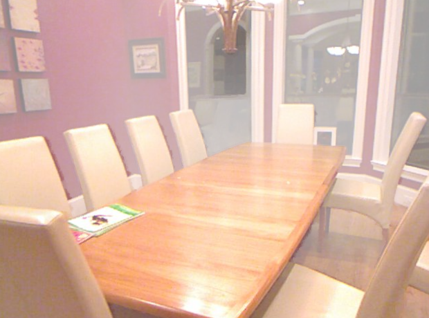

# Grid-Dehazing-Network
This is full implementation of Grid Dehazing Network.

A convolutional neural network (CNN) based approach for single image dehazing, which is fully trainable, ensuring integration and optimization of all components for dehazing tasks. The use of an attention-based multi-scale estimation on a grid network effectively addresses the bottleneck issue common in conventional multi-scale methods.In Liu’s work Trainable Pre-Processing Module provides more flexibility and relevance in image enhancement compared to hand-selected methods. His method does not rely on Atmospheric Scattering Model, which can be advantageous for handling synthetic images.

Here is the work-flow:
<figure class="half">
    
</figure>

Input Hazy image and Output Dehazed image:
<figure class="half">
    
    
</figure>
